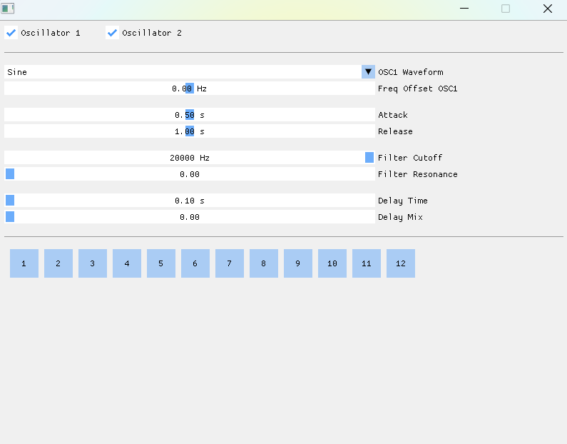

# Synthesizer

   

## Author

- Schellekens Thibault

## Project description

This project is a **C++ audio synthesizer** using **PortAudio** for sound output and **ImGui / SDL** for the user interface. It allows sound generation and modulation through several audio modules: oscillators, envelope, filter, and delay.

### Key Features

- **Oscillators**: 2 oscillators with selectable waveforms: sine, square, and saw.  
- **ASR Envelope**: controls the attack, sustain, and release of the sound.  
- **Filter**: allows shaping the sound spectrum.  
- **Delay**: adds resonance and echo effects.  
- **Graphical Interface**: interactive controls using ImGui and SDL.  

### Preview

### Demo

- [Listen to an audio sample](./demo/demo.mp4)